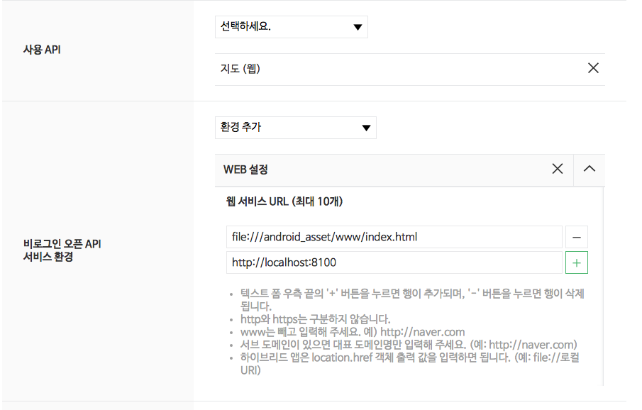
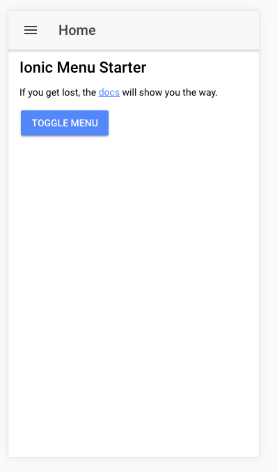
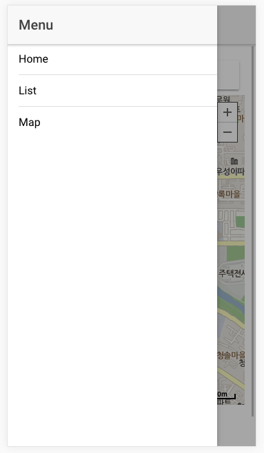
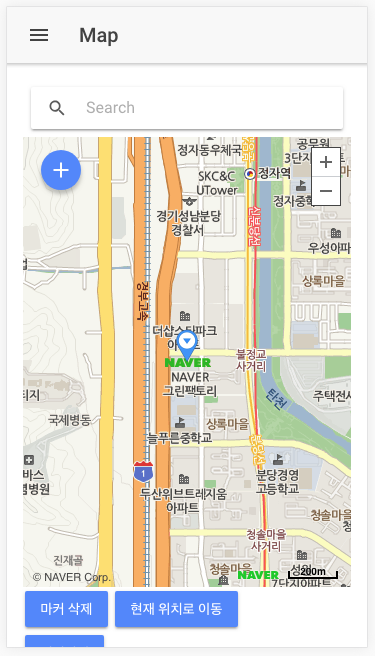

# 하이브리드앱(ionic)에 네이버맵을 적용한 예제
* * *


> ionic에서는 구글맵 플러그인(**ionic-native-google-maps**)을 사용하여 지도 기능을 넣을 수 있다.  
다국적이거나 외국을 타겟으로 한 앱의 경우 google map을 써도 되지만, 한국에서 앱을 출시하고자 할 경우 네이버맵이나 다음맵이 좀더 정확한 명칭이나 위치정보를 제공할 것이라 생각한다.  
그래서 국내맵을 한번 써보자 하였고, 네이버 맵을 적용하여 몇가지 예제를 만들어 보았다.  
[네이버지도 API v3]: https://developers.naver.com/docs/map/javascriptv3/


## 예제 설치 방법
1. 가장 먼저 네이버 맵을 사용하기 위해 api 사용신청을 해야한다.
    - https://developers.naver.com/docs/map/javascriptv3/
    - 하이브리드앱은 환경을 **웹서비스 URL**로 사용하면 되며 다음 이미지와 같이 URL을 설정해줘야만 맵을 정상적으로 사용할 수 있다.
    </img>
2. 그리고 발급 받은 키를 기억해둔다.(__소스코드를 받은 후 index.html에 script를 적용할 때 발급 키가 필요함__)
3. git clone 명령어를 통해 소스코드를 복사하거나,
    - ```$ git clone https://github.com/ahw9995/ionic-navermap-example.git ```
4. https://github.com/ahw9995/ionic-navermap-example 로 접근하여 소스파일을 다운로드 받아 압축을 푼다.
5. ```$ npm install``` 명령어를 실행하여 package.json에 정의된 모듈들을 설치한다.
6. 모듈 설치가 끝났다면 **src/index.html** 파일을 열어 <u>**your_key**</u> 부분에 발급 받은 키를 넣어준다.
```c
<script type="text/javascript" src="https://openapi.map.naver.com/openapi/v3/maps.js?clientId=your_key&submodules=geocoder"></script>
```
- your_key 뒤 &submodules=geocoder 는 서브모듈을 로드하는 것이다.
- 서브모듈 시스템: https://navermaps.github.io/maps.js/docs/tutorial-4-Submodules.html 참고

7. src/index.html까지 수정이 완료되었다면 콘솔창에 ```$ ionic serve``` 명령어를 입력하여 브라우져에 앱이 잘 뜨는지 확인한다. 문제가 없다면 아래와 같은 화면이 뜬다.
</img></img></img>
